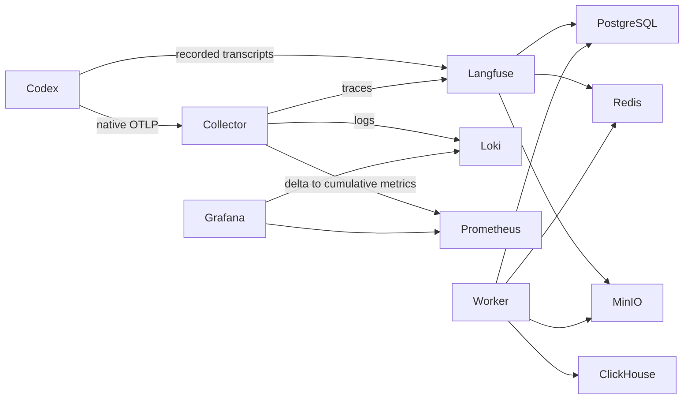

# Aorus Langfuse

Rootless Podman Quadlets for local Langfuse and Codex observability. The ten
containers share `langfuse.slice`: six CPU cores, 12 GiB memory pressure threshold,
16 GiB hard memory limit, 2 GiB swap, 4,096 tasks, and CPU/I/O weights of 25.

## Components and data flow



Each persistent application directory lives on `/mnt/aorus/langfuse`, an existing
100 GiB XFS filesystem. Web and worker are stateless. Container images remain in
Podman's existing image store; process logs use the existing user journal.
A bounded systemd timer reports filesystem capacity through Python's `statvfs`
and OTLP, without exposing database contents to the Collector.

## Installation

Run as `bcdonadio` on this host. From a contained Codex shell, execute host
commands through `ssh localhost`. The checkout is
`/mnt/bcdtank/enc/infra/donadio/langfuse` (also reachable through
`/home/bcdonadio/bcdonadioInfra/langfuse`). Do not move it without updating the
absolute paths in the two helper services and reinstalling the links.

```sh
python3 pull-images.py
python3 install.py
python3 configure-codex.py
systemctl --user start langfuse.target
python3 verify-stack.py
python3 verify-telemetry.py
# Optional controlled backend outage test:
python3 verify-recovery.py
```

`pull-images.py` uses only immutable image digests and anonymous public registry
authentication. `install.py` refuses an unexpected filesystem or an unrelated
existing unit. It creates credentials only once, copies application configuration,
links units, and enables the target. User lingering is already enabled on Aorus.
The prepare service sets ownership on directory roots using Podman's user
namespace; it never recursively changes an existing database's ownership.

The rootless container units explicitly select Podman's systemd cgroup manager,
overriding the host's `cgroupfs` default for this stack only. Their split cgroups
keep both container processes and supervisors within the aggregate slice.

## Local access and credentials

| Service | URL |
| --- | --- |
| Langfuse | http://127.0.0.1:3000 |
| Grafana | http://127.0.0.1:3001 |
| OTLP HTTP | http://127.0.0.1:4318 |
| S3 / presigned media URLs | http://127.0.0.1:9000 |

All published ports bind only to loopback. PostgreSQL, ClickHouse, Redis,
Prometheus, Loki, and the MinIO console have no host-published ports.

Read `~/.config/aorus-langfuse/credentials.json` locally to retrieve credentials.
The file and generated environment files are mode 0600, in an owner-only
configuration directory. Never commit or paste their contents into issue reports.
Langfuse login is `bcdonadio@bcdonadio.com` with `admin_password`; Grafana login is
`admin` with `grafana_password`. The Langfuse project is `codex` in organization
`aorus`. Public registration and anonymous Grafana access are disabled.

## Codex capture

See `codex-verification.md` for installation details and evidence. Native OTLP
logs, metrics, and traces go to the Collector; a verified local installation of
the official Langfuse plugin reconstructs completed recorded turns for Langfuse.
The plugin captures prompts, assistant text, recorded reasoning summaries, tool
inputs/output, and recorded subagent turns. It adds no content redaction and its
configured character limit exceeds JavaScript's representable string size.
Existing transcript omissions or truncation cannot be reconstructed. Transport
or backend rejection remains possible for excessively large individual records;
errors must be inspected rather than interpreted as successful complete capture.

The plugin's Stop hook is enabled for new sessions. Existing app-server/desktop
processes may need a normal restart to load the configuration; installation does
not terminate the active desktop. Do not confuse native operational spans with
transcript-derived conversational traces.

## Retention, capacity, and operation

Loki and Prometheus retain 14 days; Prometheus also limits retained blocks to
8 GiB (head/WAL/compaction require extra space). Langfuse Community Edition traces
remain until explicitly deleted. No unsupported ClickHouse TTL or cross-database
pruning is applied. Redis uses AOF and `noeviction`; ingestion can fail when its
bounded memory is exhausted, rather than silently evicting queue entries.

Collector queues persist on disk and are bounded by item counts. Those counts
are not byte quotas; unusually large events can use significant disk space.
Monitor the provisioned Grafana dashboard and `df -h /mnt/aorus/langfuse`.
The filesystem's 100 GiB capacity is shared by all stores. Leave free space for
ClickHouse merges, PostgreSQL WAL, Loki compaction, and image-independent backups.
Do not assume 14-day retention guarantees a fixed disk footprint.

```sh
systemctl --user status langfuse.target
systemctl --user list-units 'langfuse*'
journalctl --user -u langfuse-web -u langfuse-worker -u langfuse-collector
systemctl --user restart langfuse.target
systemctl --user stop langfuse.target
```

Dependencies advertise health before application startup. Services restart with
a 10-second delay on exit. Readiness and persistent-data checks are separate from
merely seeing an active target. See `verify-stack.py` and `verify-telemetry.py`.

## Updates and dependency verification

Versions and full SHA-256 image pins live in `images.lock.json` and the Quadlets.
Keep both synchronized. Do not enable registry auto-update or replace pins with
`latest`. Verify image provenance, native version, and compatibility; validate
configurations before starting new releases. Back up before schema migrations.
Finish Langfuse background migrations before another version change.

The user explicitly approved an image-only exception to Socket package scoring,
which does not cover these OCI images. This does not waive digest verification or
package scoring for the Codex plugin. See `DEPENDENCIES.md` for evidence and
limitations. Already-provided host Python, Podman, systemd, Git, and Node are not
reinstalled by these scripts.

## Backup, restore, deletion, and rollback

For a consistent simple backup, stop `langfuse.target`, confirm all ten containers
are stopped, and copy/snapshot all of `/mnt/aorus/langfuse` together with the
owner-only configuration directory and exact repository commit. Preserve numeric
ownership and SELinux metadata. Store backups outside this filesystem; none is
configured automatically. Start the target after the snapshot/copy completes.

Restore the matching image/configuration versions, stop the target, and restore
all data stores and credentials together while preserving mapped ownership.
Verify mount identity, restore appropriate SELinux labels through the declared
volume mounts, start the target, and run both verification scripts. A schema
migration rollback requires a matching pre-migration backup; downgrading images
alone is not a supported recovery strategy.

Delete selected Langfuse data using its UI/API so application-managed deletion
can coordinate stores. Do not remove individual ClickHouse or S3 objects manually.
Deleting the entire installation's data is destructive and requires a separate
explicit decision.

To roll back installation, disable and stop `langfuse.target`, remove only links
pointing to this checkout from `~/.config/containers/systemd` and
`~/.config/systemd/user`, and reload the user manager. Remove only the locally
installed Langfuse plugin and restore the backed-up Codex configuration after
checking for intervening unrelated edits. Preserve `/mnt/aorus/langfuse` and the
credentials until recovery is no longer needed. No uninstall step erases data.
